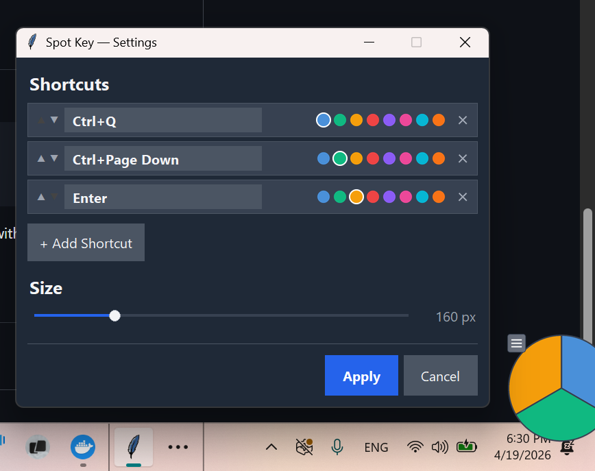

# Spot Key

A small floating pie-chart overlay for Windows that triggers keyboard shortcuts when you hover over a slice.

<p align="center">
  
</p>

Each slice represents a shortcut. Hover for 330ms and it fires — the slice lights up at the exact moment the keystroke goes through, so you always know it worked.

Shortcuts aren't limited to single key combos. Each slice can run a **sequence of actions**: multiple key presses, timed delays, and mouse clicks chained together. For example, type a word, wait half a second, then click a button.

## Install

### Download the installer

Go to [Releases](https://github.com/reasonmethis/spot-key/releases) and grab `SpotKeySetup-x.x.x.exe`. Run it — no Python needed. The installer adds a Start Menu shortcut and can optionally launch Spot Key on Windows startup.

### Run from source

If you'd rather inspect everything first:

```
git clone https://github.com/reasonmethis/spot-key.git
cd spot-key
uv run python -m spot_key
```

Requires [Python 3.12+](https://www.python.org/) and [uv](https://docs.astral.sh/uv/). You can also install it as a command with `uv tool install git+https://github.com/reasonmethis/spot-key.git`, then just run `spot-key`.

## How it works

- **Hover a slice** to trigger its shortcut (330ms dwell time prevents accidental activation)
- **Click the hamburger icon** (top-left) to open the menu, or **drag it** to reposition the pie
- **Settings** lets you add, remove, and reorder shortcuts, pick colors, and resize the pie (40-600 px)
- **System tray** — hide the pie to the tray and bring it back with a click
- Everything persists between sessions: window position, size, and all your shortcuts

<p align="center">
  
</p>

## Building the installer

To build locally (Windows only):

```
uv pip install nuitka
winget install JRSoftware.InnoSetup
uv run python build_installer.py
```

This compiles to a native executable with [Nuitka](https://nuitka.net/), then packages it into a single-file installer with [Inno Setup](https://jrsoftware.org/isinfo.php). Releases are also built automatically via GitHub Actions on version tags.

## License

MIT
