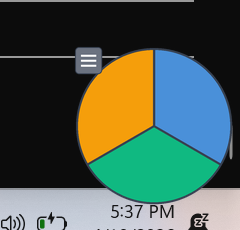

# Spot Key

A floating pie-chart widget for Windows that triggers keyboard shortcuts on hover.



Each slice of the pie represents a different keyboard shortcut. Hover over a slice for 330ms to trigger it — the slice highlights at the exact moment the keystroke fires, giving clear visual confirmation.

## Features

- **Pie-chart overlay** — configurable shortcuts, one per slice, with distinct colors
- **Hover to trigger** — deliberate 330ms dwell time prevents accidental activation
- **Action sequences** — each shortcut can run a sequence of key combos, mouse clicks, and timed delays
- **Smooth rendering** — Pillow supersampling with Win32 layered windows for true per-pixel alpha transparency (no edge fringe on any background)
- **Always on top** — stays visible over all windows, automatically re-asserts topmost status
- **Draggable** — grab the menu button (top-left) to reposition
- **Resizable** — adjust the pie diameter from the Settings dialog (40–600 px)
- **Persistent** — remembers window position, size, and shortcuts between sessions
- **System tray** — minimize to tray, restore with a click
- **DPI aware** — crisp at any display scaling

## Install

### Option A: Download the installer (recommended for most users)

Go to the [Releases](https://github.com/reasonmethis/spot-key/releases) page and download `SpotKeySetup-x.x.x.exe`. Run it — no Python needed.

The installer adds a Start Menu shortcut and optionally launches Spot Key on Windows startup.

### Option B: Run from source (developers)

Requires [Python 3.12+](https://www.python.org/) and [uv](https://docs.astral.sh/uv/).

```
git clone https://github.com/reasonmethis/spot-key.git
cd spot-key
uv run python -m spot_key
```

You can also install it as a standalone command (still needs Python):

```
uv tool install git+https://github.com/reasonmethis/spot-key.git
spot-key
```

## Default shortcuts

| Slice | Color | Shortcut |
|-------|-------|----------|
| Top | Blue | Ctrl+Q |
| Bottom-right | Green | Ctrl+C |
| Bottom-left | Amber | Enter |

Shortcuts can be customised via the Settings dialog (hamburger menu → Settings).

## Controls

- **Hover a slice** — triggers the shortcut after 330ms
- **Menu button** (top-left hamburger icon) — click to open menu, drag to reposition

## Building the installer

To build the installer locally (Windows only):

```
uv pip install nuitka
winget install JRSoftware.InnoSetup
uv run python build_installer.py
```

This compiles the app to a native executable with [Nuitka](https://nuitka.net/), then wraps it in a single-file installer with [Inno Setup](https://jrsoftware.org/isinfo.php). Output: `Output/SpotKeySetup-x.x.x.exe`.

Releases are also built automatically via GitHub Actions when a version tag (`v*`) is pushed.

## Running tests

```
uv run pytest -v
```

## License

MIT
